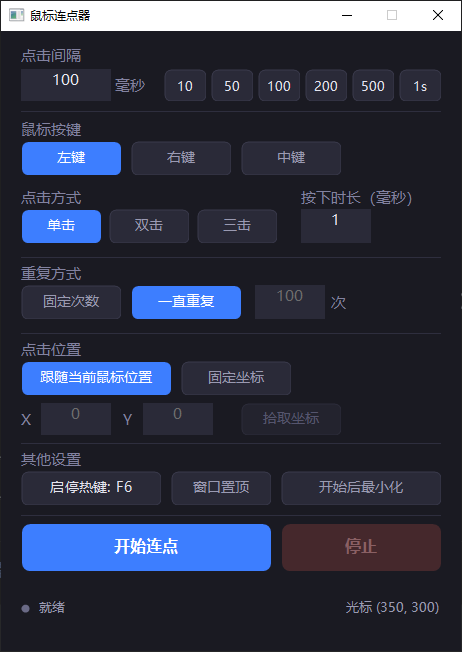

# 鼠标连点器 MouseClicker

一个用 **C++ / Win32 API** 编写的 Windows 鼠标连点器，带深色主题图形界面。
不依赖 MFC、Qt、.NET 等任何框架或第三方库，编译结果是**单个绿色 exe**，双击即用。



界面为深色主题，所有按钮均由 GDI+ 抗锯齿自绘，支持悬停 / 按下 / 选中 / 禁用四种状态。

---

## 功能

| 分类 | 说明 |
| --- | --- |
| **点击间隔** | 毫秒级可调，内置 `10 / 50 / 100 / 200 / 500 / 1s` 快捷预设 |
| **鼠标按键** | 左键 / 右键 / 中键 |
| **点击方式** | 单击 / 双击 / 三击（可设置每次按下的持续时长） |
| **重复方式** | 固定次数（精确到次数后自动停止）或一直重复直到手动停止 |
| **点击位置** | 跟随当前鼠标位置，或点击固定坐标（支持 3 秒倒计时拾取坐标） |
| **全局热键** | 默认 `F6` 启停，可自定义；在任意程序里都能控制 |
| **其他** | 窗口置顶、开始连点后自动最小化、实时显示已点击次数与光标坐标 |
| **配置持久化** | 退出时自动保存到 exe 同目录的 `MouseClicker.ini` |

---

## 快速开始

### 直接使用

运行 `bin\MouseClicker.exe`：

1. 设置**点击间隔**（毫秒），例如 100 表示每 100 毫秒点一次
2. 选择**鼠标按键**与**点击方式**
3. 选择**点击位置**：跟随鼠标，或点「固定坐标」后按「拾取坐标」
4. 按 **F6** 或点「开始连点」启动，再按 **F6** 或点「停止」结束

> 提示：把鼠标移到目标位置后按 F6 是最常用的用法。如果希望窗口不挡视线，
> 勾选「开始后最小化」，窗口会自动最小化到任务栏，用 F6 即可随时停止。

### 自定义热键

点「启停热键」按钮 → 按钮变为「请按下新热键…」→ 按下想要的键即可。
按 `Esc` 取消。

- 允许：`F1` ~ `F24`，或任何带 `Ctrl` / `Alt` / `Shift` / `Win` 的组合键
- 不允许：单独的字母、数字键（会抢走系统里所有该按键的输入）
- 若所选热键已被其他程序占用，按钮会红字提示「热键被占用」

---

## 从源码编译

### 环境要求

- Windows 10 / 11
- Visual Studio 生成工具 2022（含「使用 C++ 的桌面开发」工作负载）
  —— 只装 Build Tools 即可，不需要完整的 Visual Studio IDE
- Windows SDK（随生成工具一起安装）

### 编译

在项目根目录执行：

```bat
build.bat
```

脚本会自动查找 `vcvars64.bat` 并初始化编译环境，无需手动打开「Developer Command Prompt」。
产物输出到 `bin\MouseClicker.exe`。

调试版本：

```bat
build.bat debug
```

### 手动编译

若想自己敲命令，在已初始化的 MSVC 环境下执行：

```bat
rc /nologo /fo obj\app.res /I res res\app.rc
cl /nologo /std:c++17 /EHsc /utf-8 /O2 /MT /DNDEBUG ^
   /Fo"obj\\" /Fe"bin\MouseClicker.exe" src\main.cpp obj\app.res ^
   /link /SUBSYSTEM:WINDOWS /MANIFEST:EMBED
```

---

## 项目结构

```
mouse_clicker/
├─ src/
│  └─ main.cpp          程序全部源码（单文件，约 1000 行）
├─ res/
│  ├─ app.rc            资源脚本（图标 + 版本信息）
│  ├─ resource.h        资源 ID 定义
│  ├─ app.ico           应用图标（9 种尺寸：16 ~ 256）
│  └─ app_preview.png   图标预览图
├─ bin/
│  └─ MouseClicker.exe  编译产物
├─ obj/                 中间文件（可删除）
├─ build.bat            一键构建脚本
└─ README.md
```

---

## 实现要点

- **界面**：纯 Win32 窗口 + GDI+ 自绘。所有按钮都是 `BS_OWNERDRAW`，由 `GpGraphics`
  绘制抗锯齿圆角矩形，支持悬停/按下/选中/禁用四种状态；输入框在
  `WM_CTLCOLOREDIT` / `WM_CTLCOLORSTATIC` 中换成深色画刷，与整体暗色主题统一。
- **点击模拟**：使用 `SendInput` 投递 `MOUSEEVENTF_*DOWN/UP`。按下时长为 0 时，
  按下与抬起在同一个 `SendInput` 批次中投递，延迟最低、兼容性最好。
- **定时精度**：工作线程内 `timeBeginPeriod(1)` 提升系统定时器精度，间隔的最后
  2 毫秒改为 `yield` 自旋等待。实测设定 40ms 时平均周期为 **40.02ms**（误差 0.05%），
  设定 30ms 时为 30.35ms。等待过程按 25ms 分片轮询停止标志，保证「停止」响应足够快。
- **线程模型**：连点跑在独立 `std::thread` 中，通过 `std::atomic` 与 UI 通信；
  配置以**值拷贝**传给线程，避免数据竞争；线程结束时 `PostMessage` 通知 UI 复位按钮。
- **热键**：`RegisterHotKey` + `MOD_NOREPEAT`。捕获新热键时利用消息循环统一
  拦截 `WM_KEYDOWN`，因此焦点落在哪个子控件上都不影响捕获。
- **DPI**：进程声明 `PER_MONITOR_AWARE_V2`，所有尺寸经 `MulDiv(dpi, 96)` 换算，
  在 125% / 150% 缩放下界面不糊、布局不乱。

---

## 常见问题

**Q：点了「开始」但目标程序没有反应？**
目标程序可能以管理员权限运行（如任务管理器）。Windows 的 UIPI 机制会拦截普通
权限进程发出的模拟输入。解决办法：右键 `MouseClicker.exe` →「以管理员身份运行」。

**Q：游戏里没效果？**
使用 DirectInput / Raw Input 的游戏（尤其是带反作弊的网游）会忽略 `SendInput`
的模拟输入，这是系统安全机制，连点器无法绕过。

**Q：F6 被其他软件占用了？**
点「启停热键」换一个即可。按钮上会直接提示是否被占用。

**Q：配置文件在哪？**
`MouseClicker.ini` 与 exe 同目录，删除它即可恢复默认设置。

**Q：显示器的缩放比例较高时窗口放不下？**
界面按 DPI 等比放大，在 100% / 125% / 150% 缩放下都能完整显示；175% 及以上
缩放时窗口底部可能超出屏幕，可临时调低缩放比例。

---

## 说明

本工具仅用于合法的自动化操作（如批量点击测试、游戏内重复操作等），
请遵守目标软件的服务条款，因使用不当造成的后果由使用者自行承担。

---

## 许可证

本项目采用 **GNU General Public License v3.0** 授权，全文见 [LICENSE](LICENSE)。

```
Copyright (C) 2026 Lin1848624

This program is free software: you can redistribute it and/or modify
it under the terms of the GNU General Public License as published by
the Free Software Foundation, either version 3 of the License, or
(at your option) any later version.

This program is distributed in the hope that it will be useful,
but WITHOUT ANY WARRANTY; without even the implied warranty of
MERCHANTABILITY or FITNESS FOR A PARTICULAR PURPOSE.  See the
GNU General Public License for more details.
```
